```mermaid
flowchart TB
    subgraph current["DartsStats.AppHost.csproj"]
        MAIN["<b>📦&nbsp;DartsStats.AppHost.csproj</b><br/><small>net9.0</small>"]
        click MAIN "#dartsstatsapphostdartsstatsapphostcsproj"
    end
    subgraph downstream["Dependencies (1"]
        P1["<b>📦&nbsp;DartsStats.Api.csproj</b><br/><small>net9.0</small>"]
        click P1 "#serverdartsstatsapicsproj"
    end
    MAIN --> P1

```

```mermaid
flowchart TB
    subgraph upstream["Dependants (1)"]
        P1["<b>📦&nbsp;DartsStats.Api.csproj</b><br/><small>net9.0</small>"]
        click P1 "#serverdartsstatsapicsproj"
    end
    subgraph current["DartsStats.ServiceDefaults.csproj"]
        MAIN["<b>📦&nbsp;DartsStats.ServiceDefaults.csproj</b><br/><small>net9.0</small>"]
        click MAIN "#dartsstatsservicedefaultsdartsstatsservicedefaultscsproj"
    end
    P1 --> MAIN

```

```mermaid
flowchart TB
    subgraph upstream["Dependants (1)"]
        P2["<b>📦&nbsp;DartsStats.AppHost.csproj</b><br/><small>net9.0</small>"]
        click P2 "#dartsstatsapphostdartsstatsapphostcsproj"
    end
    subgraph current["DartsStats.Api.csproj"]
        MAIN["<b>📦&nbsp;DartsStats.Api.csproj</b><br/><small>net9.0</small>"]
        click MAIN "#serverdartsstatsapicsproj"
    end
    subgraph downstream["Dependencies (1"]
        P3["<b>📦&nbsp;DartsStats.ServiceDefaults.csproj</b><br/><small>net9.0</small>"]
        click P3 "#dartsstatsservicedefaultsdartsstatsservicedefaultscsproj"
    end
    P2 --> MAIN
    MAIN --> P3

```

# Projects and dependencies analysis

This document provides a comprehensive overview of the projects and their dependencies in the context of upgrading to .NET 9.0.

## Table of Contents

- [Projects Relationship Graph](#projects-relationship-graph)
- [Project Details](#project-details)

  - [DartsStats.AppHost\DartsStats.AppHost.csproj](#dartsstatsapphostdartsstatsapphostcsproj)
  - [DartsStats.ServiceDefaults\DartsStats.ServiceDefaults.csproj](#dartsstatsservicedefaultsdartsstatsservicedefaultscsproj)
  - [server\DartsStats.Api.csproj](#serverdartsstatsapicsproj)
- [Aggregate NuGet packages details](#aggregate-nuget-packages-details)

## Projects Relationship Graph

Legend:
📦 SDK-style project
⚙️ Classic project

```mermaid
flowchart LR
    P1["<b>📦&nbsp;DartsStats.Api.csproj</b><br/><small>net9.0</small>"]
    P2["<b>📦&nbsp;DartsStats.AppHost.csproj</b><br/><small>net9.0</small>"]
    P3["<b>📦&nbsp;DartsStats.ServiceDefaults.csproj</b><br/><small>net9.0</small>"]
    P1 --> P3
    P2 --> P1
    click P1 "#serverdartsstatsapicsproj"
    click P2 "#dartsstatsapphostdartsstatsapphostcsproj"
    click P3 "#dartsstatsservicedefaultsdartsstatsservicedefaultscsproj"

```

## Project Details

### DartsStats.AppHost\DartsStats.AppHost.csproj

#### Project Info

- **Current Target Framework:** net9.0
- **Proposed Target Framework:** net10.0
- **SDK-style**: True
- **Project Kind:** DotNetCoreApp
- **Dependencies**: 1
- **Dependants**: 0
- **Number of Files**: 2
- **Lines of Code**: 174

#### Dependency Graph

Legend:
📦 SDK-style project
⚙️ Classic project

#### Project Package References

| Package | Type | Current Version | Suggested Version | Description |
| :--- | :---: | :---: | :---: | :--- |
| Aspire.Hosting.Docker | Explicit | 13.0.0-preview.1.25560.3 |  | ✅Compatible |
| Aspire.Hosting.JavaScript | Explicit | 13.0.0 |  | ✅Compatible |
| Aspire.Hosting.Keycloak | Explicit | 13.0.0-preview.1.25560.3 |  | ✅Compatible |
| Aspire.Hosting.Redis | Explicit | 13.0.0 |  | ✅Compatible |
| Aspire.Hosting.SqlServer | Explicit | 13.0.0 |  | ✅Compatible |
| CommunityToolkit.Aspire.Hosting.SqlServer.Extensions | Explicit | 9.9.0 |  | ✅Compatible |
| DevProxy.Hosting | Explicit | 0.2.2 |  | ✅Compatible |
| StackExchange.Redis | Explicit | 2.9.32 |  | ✅Compatible |

### DartsStats.ServiceDefaults\DartsStats.ServiceDefaults.csproj

#### Project Info

- **Current Target Framework:** net9.0
- **Proposed Target Framework:** net10.0
- **SDK-style**: True
- **Project Kind:** ClassLibrary
- **Dependencies**: 0
- **Dependants**: 1
- **Number of Files**: 1
- **Lines of Code**: 127

#### Dependency Graph

Legend:
📦 SDK-style project
⚙️ Classic project

#### Project Package References

| Package | Type | Current Version | Suggested Version | Description |
| :--- | :---: | :---: | :---: | :--- |
| Microsoft.Extensions.Http.Resilience | Explicit | 9.7.0 | 10.0.0 | NuGet package upgrade is recommended |
| Microsoft.Extensions.ServiceDiscovery | Explicit | 9.4.0 | 10.0.0 | NuGet package upgrade is recommended |
| OpenTelemetry.Exporter.OpenTelemetryProtocol | Explicit | 1.12.0 |  | ✅Compatible |
| OpenTelemetry.Extensions.Hosting | Explicit | 1.12.0 |  | ✅Compatible |
| OpenTelemetry.Instrumentation.AspNetCore | Explicit | 1.12.0 | 1.14.0 | NuGet package upgrade is recommended |
| OpenTelemetry.Instrumentation.Http | Explicit | 1.12.0 | 1.14.0 | NuGet package upgrade is recommended |
| OpenTelemetry.Instrumentation.Runtime | Explicit | 1.12.0 |  | ✅Compatible |

### server\DartsStats.Api.csproj

#### Project Info

- **Current Target Framework:** net9.0
- **Proposed Target Framework:** net10.0
- **SDK-style**: True
- **Project Kind:** AspNetCore
- **Dependencies**: 1
- **Dependants**: 1
- **Number of Files**: 17
- **Lines of Code**: 2197

#### Dependency Graph

Legend:
📦 SDK-style project
⚙️ Classic project

#### Project Package References

| Package | Type | Current Version | Suggested Version | Description |
| :--- | :---: | :---: | :---: | :--- |
| Aspire.Microsoft.EntityFrameworkCore.SqlServer | Explicit | 13.0.0 |  | ✅Compatible |
| Microsoft.AspNetCore.Authentication.JwtBearer | Explicit | 9.0.11 | 10.0.0 | NuGet package upgrade is recommended |
| Microsoft.AspNetCore.OpenApi | Explicit | 9.0.7 | 10.0.0 | NuGet package upgrade is recommended |
| Microsoft.EntityFrameworkCore.Design | Explicit | 9.0.11 | 10.0.0 | NuGet package upgrade is recommended |
| Microsoft.EntityFrameworkCore.SqlServer | Explicit | 9.0.11 | 10.0.0 | NuGet package upgrade is recommended |
| Microsoft.EntityFrameworkCore.Tools | Explicit | 9.0.11 | 10.0.0 | NuGet package upgrade is recommended |
| Microsoft.Extensions.Caching.StackExchangeRedis | Explicit | 9.0.0 | 10.0.0 | NuGet package upgrade is recommended |
| Scalar.AspNetCore | Explicit | 1.2.5 |  | ✅Compatible |

## Aggregate NuGet packages details

| Package | Current Version | Suggested Version | Projects | Description |
| :--- | :---: | :---: | :--- | :--- |
| Aspire.Hosting.Docker | 13.0.0-preview.1.25560.3 |  | [DartsStats.AppHost.csproj](#dartsstatsapphostcsproj) | ✅Compatible |
| Aspire.Hosting.JavaScript | 13.0.0 |  | [DartsStats.AppHost.csproj](#dartsstatsapphostcsproj) | ✅Compatible |
| Aspire.Hosting.Keycloak | 13.0.0-preview.1.25560.3 |  | [DartsStats.AppHost.csproj](#dartsstatsapphostcsproj) | ✅Compatible |
| Aspire.Hosting.Redis | 13.0.0 |  | [DartsStats.AppHost.csproj](#dartsstatsapphostcsproj) | ✅Compatible |
| Aspire.Hosting.SqlServer | 13.0.0 |  | [DartsStats.AppHost.csproj](#dartsstatsapphostcsproj) | ✅Compatible |
| Aspire.Microsoft.EntityFrameworkCore.SqlServer | 13.0.0 |  | [DartsStats.Api.csproj](#dartsstatsapicsproj) | ✅Compatible |
| CommunityToolkit.Aspire.Hosting.SqlServer.Extensions | 9.9.0 |  | [DartsStats.AppHost.csproj](#dartsstatsapphostcsproj) | ✅Compatible |
| DevProxy.Hosting | 0.2.2 |  | [DartsStats.AppHost.csproj](#dartsstatsapphostcsproj) | ✅Compatible |
| Microsoft.AspNetCore.Authentication.JwtBearer | 9.0.11 | 10.0.0 | [DartsStats.Api.csproj](#dartsstatsapicsproj) | NuGet package upgrade is recommended |
| Microsoft.AspNetCore.OpenApi | 9.0.7 | 10.0.0 | [DartsStats.Api.csproj](#dartsstatsapicsproj) | NuGet package upgrade is recommended |
| Microsoft.EntityFrameworkCore.Design | 9.0.11 | 10.0.0 | [DartsStats.Api.csproj](#dartsstatsapicsproj) | NuGet package upgrade is recommended |
| Microsoft.EntityFrameworkCore.SqlServer | 9.0.11 | 10.0.0 | [DartsStats.Api.csproj](#dartsstatsapicsproj) | NuGet package upgrade is recommended |
| Microsoft.EntityFrameworkCore.Tools | 9.0.11 | 10.0.0 | [DartsStats.Api.csproj](#dartsstatsapicsproj) | NuGet package upgrade is recommended |
| Microsoft.Extensions.Caching.StackExchangeRedis | 9.0.0 | 10.0.0 | [DartsStats.Api.csproj](#dartsstatsapicsproj) | NuGet package upgrade is recommended |
| Microsoft.Extensions.Http.Resilience | 9.7.0 | 10.0.0 | [DartsStats.ServiceDefaults.csproj](#dartsstatsservicedefaultscsproj) | NuGet package upgrade is recommended |
| Microsoft.Extensions.ServiceDiscovery | 9.4.0 | 10.0.0 | [DartsStats.ServiceDefaults.csproj](#dartsstatsservicedefaultscsproj) | NuGet package upgrade is recommended |
| OpenTelemetry.Exporter.OpenTelemetryProtocol | 1.12.0 |  | [DartsStats.ServiceDefaults.csproj](#dartsstatsservicedefaultscsproj) | ✅Compatible |
| OpenTelemetry.Extensions.Hosting | 1.12.0 |  | [DartsStats.ServiceDefaults.csproj](#dartsstatsservicedefaultscsproj) | ✅Compatible |
| OpenTelemetry.Instrumentation.AspNetCore | 1.12.0 | 1.14.0 | [DartsStats.ServiceDefaults.csproj](#dartsstatsservicedefaultscsproj) | NuGet package upgrade is recommended |
| OpenTelemetry.Instrumentation.Http | 1.12.0 | 1.14.0 | [DartsStats.ServiceDefaults.csproj](#dartsstatsservicedefaultscsproj) | NuGet package upgrade is recommended |
| OpenTelemetry.Instrumentation.Runtime | 1.12.0 |  | [DartsStats.ServiceDefaults.csproj](#dartsstatsservicedefaultscsproj) | ✅Compatible |
| Scalar.AspNetCore | 1.2.5 |  | [DartsStats.Api.csproj](#dartsstatsapicsproj) | ✅Compatible |
| StackExchange.Redis | 2.9.32 |  | [DartsStats.AppHost.csproj](#dartsstatsapphostcsproj) | ✅Compatible |

