```mermaid
flowchart TB
    subgraph current["DartsStats.Api.csproj"]
        MAIN["<b>📦&nbsp;DartsStats.Api.csproj</b><br/><small>net9.0</small>"]
        click MAIN "#serverdartsstatsapicsproj"
    end

```

# Projects and dependencies analysis

This document provides a comprehensive overview of the projects and their dependencies in the context of upgrading to .NETCoreApp,Version=v10.0.

## Table of Contents

- [Executive Summary](#executive-Summary)
  - [Highlevel Metrics](#highlevel-metrics)
  - [Projects Compatibility](#projects-compatibility)
  - [Package Compatibility](#package-compatibility)
  - [API Compatibility](#api-compatibility)
- [Aggregate NuGet packages details](#aggregate-nuget-packages-details)
- [Top API Migration Challenges](#top-api-migration-challenges)
  - [Technologies and Features](#technologies-and-features)
  - [Most Frequent API Issues](#most-frequent-api-issues)
- [Projects Relationship Graph](#projects-relationship-graph)
- [Project Details](#project-details)

  - [server\DartsStats.Api.csproj](#serverdartsstatsapicsproj)

## Executive Summary

### Highlevel Metrics

| Metric | Count | Status |
| :--- | :---: | :--- |
| Total Projects | 1 | All require upgrade |
| Total NuGet Packages | 7 | 6 need upgrade |
| Total Code Files | 15 |  |
| Total Code Files with Incidents | 5 |  |
| Total Lines of Code | 2189 |  |
| Total Number of Issues | 47 |  |
| Estimated LOC to modify | 40+ | at least 1,8% of codebase |

### Projects Compatibility

| Project | Target Framework | Difficulty | Package Issues | API Issues | Est. LOC Impact | Description |
| :--- | :---: | :---: | :---: | :---: | :---: | :--- |
| [server\DartsStats.Api.csproj](#serverdartsstatsapicsproj) | net9.0 | 🟢 Low | 6 | 40 | 40+ | AspNetCore, Sdk Style = True |

### Package Compatibility

| Status | Count | Percentage |
| :--- | :---: | :---: |
| ✅ Compatible | 1 | 14,3% |
| ⚠️ Incompatible | 0 | 0,0% |
| 🔄 Upgrade Recommended | 6 | 85,7% |
| ***Total NuGet Packages*** | ***7*** | ***100%*** |

### API Compatibility

| Category | Count | Impact |
| :--- | :---: | :--- |
| 🔴 Binary Incompatible | 14 | High - Require code changes |
| 🟡 Source Incompatible | 10 | Medium - Needs re-compilation and potential conflicting API error fixing |
| 🔵 Behavioral change | 16 | Low - Behavioral changes that may require testing at runtime |
| ✅ Compatible | 6540 |  |
| ***Total APIs Analyzed*** | ***6580*** |  |

## Aggregate NuGet packages details

| Package | Current Version | Suggested Version | Projects | Description |
| :--- | :---: | :---: | :--- | :--- |
| Microsoft.AspNetCore.Authentication.JwtBearer | 9.0.10 | 10.0.1 | [DartsStats.Api.csproj](#serverdartsstatsapicsproj) | NuGet package upgrade is recommended |
| Microsoft.AspNetCore.OpenApi | 9.0.7 | 10.0.1 | [DartsStats.Api.csproj](#serverdartsstatsapicsproj) | NuGet package upgrade is recommended |
| Microsoft.EntityFrameworkCore.Design | 9.0.10 | 10.0.1 | [DartsStats.Api.csproj](#serverdartsstatsapicsproj) | NuGet package upgrade is recommended |
| Microsoft.EntityFrameworkCore.SqlServer | 9.0.10 | 10.0.1 | [DartsStats.Api.csproj](#serverdartsstatsapicsproj) | NuGet package upgrade is recommended |
| Microsoft.EntityFrameworkCore.Tools | 9.0.10 | 10.0.1 | [DartsStats.Api.csproj](#serverdartsstatsapicsproj) | NuGet package upgrade is recommended |
| Microsoft.Extensions.Caching.StackExchangeRedis | 9.0.0 | 10.0.1 | [DartsStats.Api.csproj](#serverdartsstatsapicsproj) | NuGet package upgrade is recommended |
| Scalar.AspNetCore | 2.11.8 |  | [DartsStats.Api.csproj](#serverdartsstatsapicsproj) | ✅Compatible |

## Top API Migration Challenges

### Technologies and Features

| Technology | Issues | Percentage | Migration Path |
| :--- | :---: | :---: | :--- |
| IdentityModel & Claims-based Security | 14 | 35,0% | Windows Identity Foundation (WIF), SAML, and claims-based authentication APIs that have been replaced by modern identity libraries. WIF was the original identity framework for .NET Framework. Migrate to Microsoft.IdentityModel.* packages (modern identity stack). |

### Most Frequent API Issues

| API | Count | Percentage | Category |
| :--- | :---: | :---: | :--- |
| T:System.Uri | 6 | 15,0% | Behavioral Change |
| T:System.Net.Http.HttpContent | 5 | 12,5% | Behavioral Change |
| P:System.IdentityModel.Tokens.Jwt.JwtSecurityToken.Claims | 5 | 12,5% | Binary Incompatible |
| T:System.Text.Json.JsonDocument | 4 | 10,0% | Behavioral Change |
| T:System.IdentityModel.Tokens.Jwt.JwtSecurityToken | 3 | 7,5% | Binary Incompatible |
| M:System.TimeSpan.FromHours(System.Int32) | 2 | 5,0% | Source Incompatible |
| M:System.IdentityModel.Tokens.Jwt.JwtSecurityTokenHandler.ReadJwtToken(System.String) | 2 | 5,0% | Binary Incompatible |
| T:System.IdentityModel.Tokens.Jwt.JwtSecurityTokenHandler | 2 | 5,0% | Binary Incompatible |
| M:System.IdentityModel.Tokens.Jwt.JwtSecurityTokenHandler.#ctor | 2 | 5,0% | Binary Incompatible |
| P:Microsoft.AspNetCore.Authentication.JwtBearer.JwtBearerOptions.TokenValidationParameters | 1 | 2,5% | Source Incompatible |
| P:Microsoft.AspNetCore.Authentication.JwtBearer.JwtBearerOptions.RequireHttpsMetadata | 1 | 2,5% | Source Incompatible |
| P:Microsoft.AspNetCore.Authentication.JwtBearer.JwtBearerOptions.Audience | 1 | 2,5% | Source Incompatible |
| P:Microsoft.AspNetCore.Authentication.JwtBearer.JwtBearerOptions.Authority | 1 | 2,5% | Source Incompatible |
| T:Microsoft.AspNetCore.Authentication.JwtBearer.JwtBearerDefaults | 1 | 2,5% | Source Incompatible |
| F:Microsoft.AspNetCore.Authentication.JwtBearer.JwtBearerDefaults.AuthenticationScheme | 1 | 2,5% | Source Incompatible |
| T:Microsoft.Extensions.DependencyInjection.JwtBearerExtensions | 1 | 2,5% | Source Incompatible |
| M:Microsoft.Extensions.DependencyInjection.JwtBearerExtensions.AddJwtBearer(Microsoft.AspNetCore.Authentication.AuthenticationBuilder,System.Action{Microsoft.AspNetCore.Authentication.JwtBearer.JwtBearerOptions}) | 1 | 2,5% | Source Incompatible |
| M:Microsoft.Extensions.DependencyInjection.HttpClientFactoryServiceCollectionExtensions.AddHttpClient(Microsoft.Extensions.DependencyInjection.IServiceCollection) | 1 | 2,5% | Behavioral Change |

## Projects Relationship Graph

Legend:
📦 SDK-style project
⚙️ Classic project

```mermaid
flowchart LR
    P1["<b>📦&nbsp;DartsStats.Api.csproj</b><br/><small>net9.0</small>"]
    click P1 "#serverdartsstatsapicsproj"

```

## Project Details

### server\DartsStats.Api.csproj

#### Project Info

- **Current Target Framework:** net9.0
- **Proposed Target Framework:** net10.0
- **SDK-style**: True
- **Project Kind:** AspNetCore
- **Dependencies**: 0
- **Dependants**: 0
- **Number of Files**: 17
- **Number of Files with Incidents**: 5
- **Lines of Code**: 2189
- **Estimated LOC to modify**: 40+ (at least 1,8% of the project)

#### Dependency Graph

Legend:
📦 SDK-style project
⚙️ Classic project

### API Compatibility

| Category | Count | Impact |
| :--- | :---: | :--- |
| 🔴 Binary Incompatible | 14 | High - Require code changes |
| 🟡 Source Incompatible | 10 | Medium - Needs re-compilation and potential conflicting API error fixing |
| 🔵 Behavioral change | 16 | Low - Behavioral changes that may require testing at runtime |
| ✅ Compatible | 6540 |  |
| ***Total APIs Analyzed*** | ***6580*** |  |

#### Project Technologies and Features

| Technology | Issues | Percentage | Migration Path |
| :--- | :---: | :---: | :--- |
| IdentityModel & Claims-based Security | 14 | 35,0% | Windows Identity Foundation (WIF), SAML, and claims-based authentication APIs that have been replaced by modern identity libraries. WIF was the original identity framework for .NET Framework. Migrate to Microsoft.IdentityModel.* packages (modern identity stack). |

