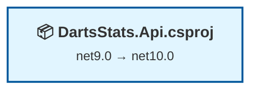

# .NET 10 Upgrade Plan

## Table of Contents

- [Executive Summary](#executive-summary)
- [Migration Strategy](#migration-strategy)
- [Detailed Dependency Analysis](#detailed-dependency-analysis)
- [Project-by-Project Plans](#project-by-project-plans)
- [Package Update Reference](#package-update-reference)
- [Breaking Changes Catalog](#breaking-changes-catalog)
- [Risk Management](#risk-management)
- [Testing & Validation Strategy](#testing--validation-strategy)
- [Complexity & Effort Assessment](#complexity--effort-assessment)
- [Source Control Strategy](#source-control-strategy)
- [Success Criteria](#success-criteria)

---

## Executive Summary

### Scenario Description
This plan guides the upgrade of the DartsStats solution from **.NET 9.0** to **.NET 10.0 (Long Term Support)**. The solution consists of a single ASP.NET Core Web API project (`DartsStats.Api`) with Entity Framework Core, JWT authentication via Keycloak, Redis caching, and OpenAPI documentation.

### Scope

**Projects Affected:**
- `server\DartsStats.Api.csproj` - ASP.NET Core Web API (net9.0 → net10.0)

**Current State:**
- Target Framework: .NET 9.0
- 7 NuGet packages (6 require updates, 1 compatible)
- 2,189 lines of code
- 5 code files with compatibility incidents

**Target State:**
- Target Framework: .NET 10.0 (LTS)
- All packages upgraded to 10.0.1 compatible versions
- All API compatibility issues resolved
- Zero build warnings or errors

### Selected Strategy

**All-At-Once Strategy** - All project files and package references upgraded simultaneously in a single atomic operation.

**Rationale:**
- **Single Project**: Only 1 project to upgrade (no coordination complexity)
- **No Dependencies**: Zero project dependencies (no dependency ordering concerns)
- **Low Complexity**: 2,189 LOC, 47 compatibility issues (mostly behavioral changes)
- **Clear Upgrade Path**: All 6 packages have known .NET 10 compatible versions (10.0.1)
- **Modern Stack**: Already on .NET 9.0 (single version jump to .NET 10.0)

### Complexity Assessment

**Discovered Metrics:**
- **Total Projects**: 1
- **Total Packages**: 7 (85.7% need upgrade)
- **Code Files with Issues**: 5 out of 15 (33%)
- **Total Compatibility Issues**: 47
  - Binary Incompatible: 14 (primarily JWT/Identity APIs)
  - Source Incompatible: 10 (JWT bearer options)
  - Behavioral Changes: 16 (Uri, HttpContent, JsonDocument)
  - Compatible APIs: 6,540
- **Estimated Code Changes**: 40+ lines (1.8% of codebase)

**Complexity Rating: 🟢 Low**

### Critical Issues

**No Security Vulnerabilities** - All package updates are for framework compatibility, not security patches.

**Primary Challenge Area:**
- **IdentityModel & JWT Authentication** (35% of issues) - Binary incompatible changes in `System.IdentityModel.Tokens.Jwt` and `Microsoft.AspNetCore.Authentication.JwtBearer` packages require code adjustments after package upgrades.

### Recommended Approach

**Single Atomic Operation:**
1. Update project file target framework to net10.0
2. Update all 6 package references to version 10.0.1
3. Restore dependencies and build
4. Fix all compilation errors in one pass (JWT APIs, behavioral changes)
5. Validate build succeeds with zero warnings
6. Execute tests (if present)

**Iteration Strategy:** Fast Batch (2-3 planning iterations) - Simple solution enables rapid plan generation with comprehensive project details in minimal iterations.

**Timeline:** Single upgrade phase followed by validation phase. No intermediate migration states.

---

## Migration Strategy

### Approach Selection

**Selected: All-At-Once Strategy**

All project file updates, package reference updates, and compilation fixes will be performed as a **single coordinated operation** with no intermediate states.

### Justification

**Why All-At-Once is Optimal:**

1. **Single Project Simplicity**
   - Only 1 project to upgrade eliminates coordination complexity
   - No risk of dependency version mismatches between projects
   - No need to maintain multiple framework versions simultaneously

2. **Modern Starting Point**
   - Currently on .NET 9.0 (released November 2024)
   - Single version jump to .NET 10.0 (released November 2025)
   - Both frameworks are modern, minimal breaking changes expected

3. **Clear Package Upgrade Path**
   - All 6 packages have known .NET 10 versions (10.0.1)
   - All packages from Microsoft, predictable upgrade behavior
   - No incompatible packages requiring workarounds

4. **Low Risk Profile**
   - Difficulty rating: 🟢 Low
   - 47 compatibility issues across 6,540 APIs (0.7% incompatibility rate)
   - Most issues are behavioral changes (16), not breaking changes
   - Estimated impact: 40 lines (1.8% of codebase)

5. **Faster Completion**
   - No multi-targeting complexity
   - No phase-by-phase testing cycles
   - Single build/test/validate cycle
   - Can be completed in single development session

**Why NOT Incremental:**
- Incremental migration is designed for large solutions (5+ projects) with complex dependencies
- Single project has nothing to migrate incrementally
- Would add unnecessary overhead without risk reduction benefits

### All-At-Once Strategy Principles

**Atomic Operation:**
- All framework and package updates applied together
- Build errors addressed immediately after updates
- No commits until entire upgrade compiles successfully

**Single Testing Cycle:**
- Comprehensive validation after all changes complete
- No intermediate "partial upgrade" state to test

**Unified Rollback:**
- If upgrade fails, single Git revert restores entire solution
- No complex multi-commit rollback coordination

### Dependency-Based Ordering

**Not Applicable** - Single project means no dependency ordering concerns.

The upgrade sequence is determined by **logical operation order**:
1. Project file framework property update
2. Package reference version updates
3. Dependency restoration
4. Build to identify errors
5. Fix compilation errors
6. Rebuild to verify
7. Execute tests

### Execution Approach

**Sequential Execution Within Atomic Operation:**

All operations within the atomic upgrade must be performed in sequence because they have dependencies:
- Cannot update packages before updating target framework (version constraints)
- Cannot restore dependencies before updating package references
- Cannot fix compilation errors before building (errors not yet known)
- Cannot verify success before fixing errors

**No Parallelization** - Single project, sequential operations required.

### Phase Definitions

**Phase 0: Prerequisites**
- Verify .NET 10 SDK installed
- Check for global.json constraints
- Confirm starting branch and backup strategy

**Phase 1: Atomic Upgrade**
- Update project file target framework to net10.0
- Update all 6 package references to 10.0.1
- Restore dependencies (`dotnet restore`)
- Build solution to identify compilation errors
- Fix all compilation errors (JWT APIs, behavioral changes)
- Rebuild to verify zero errors

**Phase 2: Validation**
- Execute tests (if test projects exist)
- Smoke test application startup
- Verify no runtime warnings in logs

**Deliverable:** Solution builds and runs on .NET 10.0 with zero errors.

---

## Detailed Dependency Analysis

### Dependency Graph Summary

The DartsStats solution has a **trivial dependency structure** - a single standalone ASP.NET Core Web API project with no project-to-project dependencies.

**Project Structure:**
```
DartsStats.Api.csproj (net9.0)
├── No project dependencies
└── No dependent projects
```

**Mermaid Diagram:**


### Project Groupings by Migration Phase

**Phase 1: Atomic Upgrade (All Projects)**
- `server\DartsStats.Api.csproj`

Since there is only one project, all migration activities occur in a single coordinated phase.

### Critical Path Identification

**No Critical Path** - With a single project and no dependencies:
- No blocking dependencies that must be migrated first
- No downstream consumers that could be impacted
- No parallel migration coordination required
- Single atomic upgrade operation

### Circular Dependencies

**None** - No project dependencies means no possibility of circular references.

### External Dependencies

The project depends on **7 NuGet packages**:

**Packages Requiring Upgrade:**
1. `Microsoft.AspNetCore.Authentication.JwtBearer` (9.0.10 → 10.0.1)
2. `Microsoft.AspNetCore.OpenApi` (9.0.7 → 10.0.1)
3. `Microsoft.EntityFrameworkCore.Design` (9.0.10 → 10.0.1)
4. `Microsoft.EntityFrameworkCore.SqlServer` (9.0.10 → 10.0.1)
5. `Microsoft.EntityFrameworkCore.Tools` (9.0.10 → 10.0.1)
6. `Microsoft.Extensions.Caching.StackExchangeRedis` (9.0.0 → 10.0.1)

**Packages Already Compatible:**
7. `Scalar.AspNetCore` (2.11.8) - Third-party OpenAPI UI, already compatible with .NET 10

All Microsoft packages will be upgraded simultaneously as part of the atomic operation.

---

## Project-by-Project Plans

### Project: server\DartsStats.Api.csproj

**Current State:**
- Target Framework: net9.0
- Project Type: ASP.NET Core Web API
- SDK-Style: Yes
- Dependencies: 0 project references
- Package Count: 7 NuGet packages
- Lines of Code: 2,189
- Files with Issues: 5 out of 15
  - `server/Program.cs` (JWT bearer configuration)
  - `server/Controllers/AuthController.cs` (JWT token handling)
  - `server/Controllers/VenuesController.cs` (HTTP client, caching)

**Target State:**
- Target Framework: net10.0
- All packages upgraded to 10.0.1
- Zero compilation errors
- Zero warnings

**Migration Steps:**

#### 1. Prerequisites

**Verify .NET 10 SDK Installation:**
```bash
dotnet --list-sdks
```
Expected: .NET 10.0.x SDK installed

**Check for global.json Constraints:**
```bash
# Search for global.json files in repo
Get-ChildItem -Path . -Recurse -Filter global.json
```
If global.json exists and pins SDK version < 10.0, update it or remove SDK version constraint.

#### 2. Update Project File Target Framework

**File:** `server/DartsStats.Api.csproj`

**Change:**
```xml
<TargetFramework>net9.0</TargetFramework>
```
**To:**
```xml
<TargetFramework>net10.0</TargetFramework>
```

#### 3. Update Package References

**File:** `server/DartsStats.Api.csproj`

Update all 6 package versions simultaneously:

| Package | Current Version | Target Version |
|---------|-----------------|----------------|
| Microsoft.AspNetCore.Authentication.JwtBearer | 9.0.10 | 10.0.1 |
| Microsoft.AspNetCore.OpenApi | 9.0.7 | 10.0.1 |
| Microsoft.EntityFrameworkCore.Design | 9.0.10 | 10.0.1 |
| Microsoft.EntityFrameworkCore.SqlServer | 9.0.10 | 10.0.1 |
| Microsoft.EntityFrameworkCore.Tools | 9.0.10 | 10.0.1 |
| Microsoft.Extensions.Caching.StackExchangeRedis | 9.0.0 | 10.0.1 |

**Example PackageReference Change:**
```xml
<!-- Before -->
<PackageReference Include="Microsoft.AspNetCore.Authentication.JwtBearer" Version="9.0.10" />

<!-- After -->
<PackageReference Include="Microsoft.AspNetCore.Authentication.JwtBearer" Version="10.0.1" />
```

Repeat for all 6 packages.

**Note:** `Scalar.AspNetCore` (2.11.8) is already compatible, no update needed.

#### 4. Restore Dependencies and Build

**Restore:**
```bash
cd "E:\DartsStats\Start Demo\server"
dotnet restore
```

**Build to Identify Errors:**
```bash
dotnet build
```

Expected result: Compilation errors related to JWT APIs, source incompatibilities.

#### 5. Expected Breaking Changes

Based on assessment, expect compilation errors in these areas:

**A. JWT Authentication Configuration (server/Program.cs, Lines 38-57)**

**Issue Category:** Source Incompatible (Api.0002)

**Affected APIs:**
- `JwtBearerDefaults.AuthenticationScheme`
- `JwtBearerOptions.Authority`
- `JwtBearerOptions.Audience`
- `JwtBearerOptions.RequireHttpsMetadata`
- `JwtBearerOptions.TokenValidationParameters`

**Likely Fix:** No code changes required - these are source incompatible (require recompilation) but APIs remain available. Build should succeed after package upgrade.

**Verification:** After package upgrade, confirm JWT authentication middleware still configures correctly.

**B. JWT Token Handling (server/Controllers/AuthController.cs, Lines 230-270)**

**Issue Category:** Binary Incompatible (Api.0001)

**Affected APIs:**
- `JwtSecurityToken` type (line 230)
- `JwtSecurityToken.Claims` property (lines 235, 239, 265)
- `JwtSecurityTokenHandler.ReadJwtToken()` (if used)

**Migration Path (from assessment):**
- Windows Identity Foundation (WIF) APIs replaced by `Microsoft.IdentityModel.*` packages
- Modern identity stack already in use via `Microsoft.AspNetCore.Authentication.JwtBearer` 10.0.1

**Likely Fix:** 
- `JwtSecurityToken.Claims` returns `IEnumerable<Claim>` - ensure LINQ queries (.FirstOrDefault, .Where) are compatible
- If compilation errors occur, may need to explicitly enumerate claims: `.Claims.ToList().FirstOrDefault(...)`

**Example Current Code (Line 265):**
```csharp
var resourceAccessClaim = jwtToken.Claims.FirstOrDefault(c => c.Type == "resource_access");
```

**If Error Occurs, Try:**
```csharp
var resourceAccessClaim = jwtToken.Claims.ToList().FirstOrDefault(c => c.Type == "resource_access");
```

**C. TimeSpan.FromHours (server/Controllers/VenuesController.cs, Line 75)**

**Issue Category:** Source Incompatible (Api.0002)

**Affected API:**
- `TimeSpan.FromHours(System.Int32) `

**Current Code:**
```csharp
await _cacheService.SetAsync(cacheKey, venueInfo, TimeSpan.FromHours(cacheExpirationHours));
```

**Likely Fix:** No changes required - source incompatible means recompilation needed but API signature unchanged. If error occurs, ensure `cacheExpirationHours` is explicitly typed as `int`.

**D. Behavioral Changes (No Compilation Errors Expected)**

**Issue Category:** Behavioral Change (Api.0003)

**Affected APIs:**
- `System.Uri` (VenuesController.cs, lines 173, 276)
- `System.Net.Http.HttpContent` (VenuesController.cs, lines 183, 282)
- `System.Text.Json.JsonDocument` (AuthController.cs, lines 244, 270)

**Impact:** These APIs have behavioral changes in .NET 10 (e.g., stricter null handling, parsing edge cases). No compilation errors expected, but **runtime testing required**.

**Testing Focus:**
- `Uri.EscapeDataString()` - verify Wikipedia API URL encoding still works
- `HttpContent.ReadAsStringAsync()` - verify HTTP response parsing
- `JsonDocument.Parse()` - verify JSON parsing (realm_access, resource_access claims)

#### 6. Code Modifications

**Anticipated Changes:**

**File: server/Program.cs**
- **Lines 38-57**: No changes expected (source incompatible APIs still available)
- **Action:** Rebuild and verify JWT bearer authentication compiles

**File: server/Controllers/AuthController.cs**
- **Lines 230-270**: May need to add `.ToList()` calls if `JwtSecurityToken.Claims` LINQ queries fail
- **Action:** Address compilation errors for Claims property access

**File: server/Controllers/VenuesController.cs**
- **Lines 75, 173, 183, 276, 282**: No compilation changes expected (behavioral only)
- **Action:** Test runtime behavior of Uri escaping, HTTP client, caching

#### 7. Rebuild and Verify

```bash
dotnet build
```

**Success Criteria:**
- Build succeeds with 0 errors
- Build succeeds with 0 warnings
- All files compile successfully

#### 8. Testing Strategy

**Unit Tests:**
- If test projects exist, run: `dotnet test`
- Expected: All tests pass (no behavioral regressions)

**Integration Testing Focus Areas:**

**A. JWT Authentication (Critical)**
```
Test Scenarios:
- Valid JWT token from Keycloak validates successfully
- Invalid token rejected (expired, wrong signature, wrong audience)
- Role extraction from realm_access claim works
- Role extraction from resource_access claim works
- Admin-only endpoints enforce AdminOnly policy
```

**B. HTTP Client & External APIs**
```
Test Scenarios:
- Wikipedia API calls via HttpClient work (Uri escaping)
- JSON response parsing via HttpContent.ReadAsStringAsync()
- Fallback Wikipedia API URL construction
```

**C. Redis Caching**
```
Test Scenarios:
- Cache SET operations work (TimeSpan.FromHours)
- Cache GET operations return expected values
- Cache expiration honors TTL
```

**D. Entity Framework Core**
```
Test Scenarios:
- Database connection succeeds
- Queries return expected data
- Migrations apply successfully (if any pending)
- Database seeding completes
```

**Manual Smoke Testing:**
1. Start application: `dotnet run --project server/DartsStats.Api.csproj`
2. Verify no startup errors in logs
3. Access OpenAPI docs: `https://localhost:<port>/scalar/v1`
4. Test authenticated endpoint with valid Keycloak token
5. Test venues controller endpoints (caching + Wikipedia API)

#### 9. Validation Checklist

- [ ] .NET 10 SDK installed
- [ ] No global.json blocking SDK version
- [ ] Project file updated to net10.0
- [ ] All 6 packages updated to 10.0.1
- [ ] `dotnet restore` succeeds
- [ ] `dotnet build` succeeds with 0 errors
- [ ] `dotnet build` succeeds with 0 warnings
- [ ] JWT authentication compiles without errors
- [ ] Claims extraction compiles without errors
- [ ] Unit tests pass (if present)
- [ ] Application starts without errors
- [ ] JWT authentication works at runtime
- [ ] Wikipedia API calls work (Uri, HttpContent)
- [ ] JSON parsing works (realm_access, resource_access)
- [ ] Redis caching works (TimeSpan.FromHours)
- [ ] Database operations work (EF Core 10)
- [ ] No runtime warnings in logs

## Package Update Reference

### Package Update Matrix

All package updates target version **10.0.1** for .NET 10 compatibility.

| Package | Current | Target | Projects Affected | Update Reason | Documentation |
|---------|---------|--------|-------------------|---------------|---------------|
| Microsoft.AspNetCore.Authentication.JwtBearer | 9.0.10 | 10.0.1 | DartsStats.Api | .NET 10 framework compatibility | [Docs](https://go.microsoft.com/fwlink/?linkid=2262530) |
| Microsoft.AspNetCore.OpenApi | 9.0.7 | 10.0.1 | DartsStats.Api | .NET 10 framework compatibility | [Docs](https://go.microsoft.com/fwlink/?linkid=2262530) |
| Microsoft.EntityFrameworkCore.Design | 9.0.10 | 10.0.1 | DartsStats.Api | .NET 10 framework compatibility | [Docs](https://go.microsoft.com/fwlink/?linkid=2262530) |
| Microsoft.EntityFrameworkCore.SqlServer | 9.0.10 | 10.0.1 | DartsStats.Api | .NET 10 framework compatibility | [Docs](https://go.microsoft.com/fwlink/?linkid=2262530) |
| Microsoft.EntityFrameworkCore.Tools | 9.0.10 | 10.0.1 | DartsStats.Api | .NET 10 framework compatibility | [Docs](https://go.microsoft.com/fwlink/?linkid=2262530) |
| Microsoft.Extensions.Caching.StackExchangeRedis | 9.0.0 | 10.0.1 | DartsStats.Api | .NET 10 framework compatibility | [Docs](https://go.microsoft.com/fwlink/?linkid=2262530) |
| Scalar.AspNetCore | 2.11.8 | *(no change)* | DartsStats.Api | Already compatible | Third-party package |

### Package Categories

#### Authentication Packages
**Scope:** JWT bearer token authentication for Keycloak integration

- **Microsoft.AspNetCore.Authentication.JwtBearer** (9.0.10 → 10.0.1)
  - **Breaking Changes:** Source incompatible APIs (JwtBearerDefaults, JwtBearerOptions)
  - **Action Required:** Recompilation (no code changes expected)
  - **Risk:** 🟢 Low - APIs remain available, just require recompilation

#### Entity Framework Core Packages
**Scope:** Database access via SQL Server provider

- **Microsoft.EntityFrameworkCore.SqlServer** (9.0.10 → 10.0.1)
  - **Breaking Changes:** None identified
  - **Action Required:** Update version, test database operations
  - **Risk:** 🟢 Low - EF Core 10 backward compatible with EF 9 schemas

- **Microsoft.EntityFrameworkCore.Design** (9.0.10 → 10.0.1)
  - **Usage:** Design-time tooling for migrations
  - **Action Required:** Update version
  - **Risk:** 🟢 Trivial - Design-time only

- **Microsoft.EntityFrameworkCore.Tools** (9.0.10 → 10.0.1)
  - **Usage:** Package Manager Console tools
  - **Action Required:** Update version
  - **Risk:** 🟢 Trivial - Tooling only

#### Caching Packages
**Scope:** Redis distributed cache integration

- **Microsoft.Extensions.Caching.StackExchangeRedis** (9.0.0 → 10.0.1)
  - **Breaking Changes:** None identified
  - **Action Required:** Update version, test cache operations
  - **Risk:** 🟢 Low - Caching abstraction stable

#### OpenAPI/Documentation Packages
**Scope:** API documentation and Scalar UI

- **Microsoft.AspNetCore.OpenApi** (9.0.7 → 10.0.1)
  - **Breaking Changes:** None identified
  - **Action Required:** Update version, verify OpenAPI generation
  - **Risk:** 🟢 Low - Stable API

- **Scalar.AspNetCore** (2.11.8 - no change)
  - **Compatibility:** Already supports .NET 10
  - **Action Required:** None
  - **Risk:** None - Third-party package

### Update Sequence

All packages must be updated **simultaneously** as part of the atomic upgrade operation. No incremental package updates.

**Rationale:**
- All Microsoft packages share version 10.0.1 (aligned with .NET 10 release)
- Updating subset of packages creates version conflicts
- Target framework change (net9.0 → net10.0) requires all packages compatible with net10.0

### Compatibility Notes

**No Security Vulnerabilities:** All updates are for framework compatibility, not security patches.

**Version Alignment:** All Microsoft packages align on 10.0.1 (November 2025 release wave).

**Third-Party Compatibility:** Scalar.AspNetCore 2.11.8 explicitly supports .NET 10.0, no update required.

---

## Breaking Changes Catalog

### Overview

The upgrade from .NET 9 to .NET 10 introduces **47 compatibility issues** across 3 categories:

- **14 Binary Incompatible** (High impact - require code changes)
- **10 Source Incompatible** (Medium impact - require recompilation, may need code changes)
- **16 Behavioral Changes** (Low impact - runtime testing required)

### Category 1: Binary Incompatible (14 Issues)

**Definition:** APIs that have changed in a way that breaks binary compatibility. Recompilation required, code changes likely needed.

#### 1.1 JwtSecurityToken Type Changes

**Affected File:** `server/Controllers/AuthController.cs`

**Issue:** `System.IdentityModel.Tokens.Jwt.JwtSecurityToken` type has binary incompatible changes.

**Occurrences:**
- Line 230: Method signature `private static List<string> ExtractRolesFromToken(JwtSecurityToken jwtToken)`

**Impact:** Type definition changed in .NET 10. Recompilation required.

**Fix:** No code changes expected - type remains available but with updated binary structure.

**Documentation:** [.NET Breaking Changes](https://go.microsoft.com/fwlink/?linkid=2262679)

#### 1.2 JwtSecurityToken.Claims Property (5 Occurrences)

**Affected File:** `server/Controllers/AuthController.cs`

**Issue:** `System.IdentityModel.Tokens.Jwt.JwtSecurityToken.Claims` property has binary incompatible changes.

**Occurrences:**
- Line 235: `var rolesClaims = jwtToken.Claims.Where(c => c.Type == "roles").Select(c => c.Value);`
- Line 239: `var realmAccessClaim = jwtToken.Claims.FirstOrDefault(c => c.Type == "realm_access");`
- Line 265: `var resourceAccessClaim = jwtToken.Claims.FirstOrDefault(c => c.Type == "resource_access");`

**Impact:** Claims property may return different interface/type. LINQ queries may fail if interface contract changed.

**Likely Fix:**
```csharp
// If LINQ fails, explicitly enumerate:
var claims = jwtToken.Claims.ToList();
var rolesClaims = claims.Where(c => c.Type == "roles").Select(c => c.Value);
```

**Alternative:** Claims property may already work - test after recompilation before applying fix.

**Documentation:** [.NET Breaking Changes](https://go.microsoft.com/fwlink/?linkid=2262679)

#### 1.3 JwtSecurityTokenHandler (4 Occurrences)

**Affected File:** `server/Controllers/AuthController.cs` (if used)

**Issue:** `System.IdentityModel.Tokens.Jwt.JwtSecurityTokenHandler` type and methods have binary incompatible changes.

**Affected APIs:**
- `JwtSecurityTokenHandler` constructor
- `JwtSecurityTokenHandler.ReadJwtToken(string)` method

**Impact:** If AuthController uses JwtSecurityTokenHandler to parse tokens, recompilation and possible code changes required.

**Fix:** Verify handler instantiation and ReadJwtToken calls still work. Consult Microsoft.IdentityModel migration guide if errors occur.

**Documentation:** [.NET Breaking Changes](https://go.microsoft.com/fwlink/?linkid=2262679)

---

### Category 2: Source Incompatible (10 Issues)

**Definition:** APIs that have changed in a way that breaks source compatibility. Recompilation required, code usually still works.

#### 2.1 JWT Bearer Authentication Configuration (9 Issues)

**Affected File:** `server/Program.cs`, Lines 38-57

**Issues:** All JWT bearer authentication APIs marked as source incompatible.

**Affected APIs:**
- `JwtBearerDefaults.AuthenticationScheme` (line 38)
- `JwtBearerExtensions.AddJwtBearer()` method (line 38)
- `JwtBearerOptions.Authority` (line 44)
- `JwtBearerOptions.Audience` (line 45)
- `JwtBearerOptions.RequireHttpsMetadata` (line 46)
- `JwtBearerOptions.TokenValidationParameters` (line 48)

**Current Code (Lines 38-57):**
```csharp
builder.Services.AddAuthentication(JwtBearerDefaults.AuthenticationScheme)
    .AddJwtBearer(options =>
    {
        var keycloakAuthority = builder.Configuration["Keycloak:Authority"];
        var keycloakAudience = builder.Configuration["Keycloak:Audience"];

        options.Authority = keycloakAuthority;
        options.Audience = keycloakAudience;
        options.RequireHttpsMetadata = !builder.Environment.IsDevelopment();
        
        options.TokenValidationParameters = new TokenValidationParameters
        {
            ValidateIssuer = true,
            ValidateAudience = true,
            ValidateLifetime = true,
            ValidateIssuerSigningKey = true,
            ValidAudience = keycloakAudience,
            ValidIssuer = keycloakAuthority,
            ClockSkew = TimeSpan.Zero
        };
    });
```

**Impact:** APIs are source incompatible but still available. Recompilation required, **no code changes expected**.

**Fix:** None expected - rebuild project and verify authentication middleware configures correctly.

**Risk:** 🟢 Low - Microsoft maintains backward compatibility for authentication APIs. Source incompatibility likely indicates metadata/signature changes that don't affect usage.

**Verification:** After upgrade, test JWT authentication flow end-to-end.

#### 2.2 TimeSpan.FromHours (1 Issue)

**Affected File:** `server/Controllers/VenuesController.cs`, Line 75

**Issue:** `System.TimeSpan.FromHours(System.Int32)` marked as source incompatible.

**Current Code:**
```csharp
await _cacheService.SetAsync(cacheKey, venueInfo, TimeSpan.FromHours(cacheExpirationHours));
```

**Impact:** Method signature may have metadata changes. Recompilation required.

**Fix:** No code changes expected. If error occurs, ensure `cacheExpirationHours` is explicitly typed as `int`.

**Risk:** 🟢 Trivial - TimeSpan is fundamental BCL type, highly stable.

**Documentation:** [.NET Breaking Changes](https://go.microsoft.com/fwlink/?linkid=2262679)

---

### Category 3: Behavioral Changes (16 Issues)

**Definition:** APIs that remain binary/source compatible but have behavior changes in .NET 10. **No compilation errors expected**, but runtime behavior may differ.

#### 3.1 System.Uri (6 Issues)

**Affected File:** `server/Controllers/VenuesController.cs`

**Occurrences:**
- Line 173: `Uri.EscapeDataString(venueName)` in Wikipedia API URL
- Line 276: `Uri.EscapeDataString(venueName)` in fallback Wikipedia API URL

**Behavioral Change:** Uri parsing, escaping, or null handling may have changed in .NET 10.

**Impact:** Wikipedia API URL construction may behave differently (e.g., different escaping for special characters).

**Testing Required:**
```
Test Scenarios:
- Venue names with spaces: "Madison Square Garden"
- Venue names with special chars: "O2 Arena", "Ally Pally"
- Venue names with apostrophes: "Alexandra Palace's Arena"
- Verify escaped URLs work with Wikipedia API
```

**Fix:** If Wikipedia API calls fail, inspect escaped URLs and adjust escaping logic if needed.

**Risk:** 🟡 Medium - Uri.EscapeDataString is well-tested, but behavioral changes could break external API calls.

#### 3.2 System.Net.Http.HttpContent (5 Issues)

**Affected File:** `server/Controllers/VenuesController.cs`

**Occurrences:**
- Line 183: `await response.Content.ReadAsStringAsync();`
- Line 282: `await response.Content.ReadAsStringAsync();`

**Behavioral Change:** HttpContent reading, encoding detection, or null handling may have changed.

**Impact:** Wikipedia API response parsing may behave differently.

**Testing Required:**
```
Test Scenarios:
- Successfully parse JSON responses from Wikipedia
- Handle empty/null responses gracefully
- Handle malformed JSON responses
```

**Fix:** If parsing fails, inspect response content and adjust ReadAsStringAsync usage or add defensive null checks.

**Risk:** 🟢 Low - HttpContent.ReadAsStringAsync is stable API.

#### 3.3 System.Text.Json.JsonDocument (4 Issues)

**Affected File:** `server/Controllers/AuthController.cs`

**Occurrences:**
- Line 244: `using var doc = JsonDocument.Parse(realmAccessClaim.Value);` (2 reported instances)
- Line 270: `using var doc = JsonDocument.Parse(resourceAccessClaim.Value);` (2 reported instances)

**Behavioral Change:** JSON parsing, null handling, or error handling may have changed.

**Impact:** Keycloak JWT claims parsing (realm_access, resource_access) may behave differently.

**Testing Required:**
```
Test Scenarios:
- Parse realm_access claim with roles array
- Parse resource_access claim with nested client roles
- Handle missing realm_access claim gracefully
- Handle missing resource_access claim gracefully
- Handle malformed JSON in claims
```

**Fix:** If parsing fails, inspect claim values and add defensive null checks or try-catch blocks.

**Risk:** 🟡 Medium - JWT claims parsing is critical for authorization. Behavioral changes could break role extraction.

#### 3.4 HttpClient Factory (1 Issue)

**Affected File:** `server/Program.cs`

**Issue:** `HttpClientFactoryServiceCollectionExtensions.AddHttpClient()` has behavioral change.

**Current Code (approximate):**
```csharp
builder.Services.AddHttpClient();
```

**Impact:** HttpClient factory registration or default configuration may have changed.

**Testing Required:**
- Verify HttpClient injection works in VenuesController
- Verify Wikipedia API HTTP requests succeed

**Fix:** Unlikely to require changes - behavioral change probably affects edge cases.

**Risk:** 🟢 Low - AddHttpClient is stable registration method.

---

### Migration Path Guidance

**From Assessment:**
> "Windows Identity Foundation (WIF), SAML, and claims-based authentication APIs have been replaced by modern identity libraries. Migrate to Microsoft.IdentityModel.* packages (modern identity stack)."

**Current State:**
- Project already uses `Microsoft.AspNetCore.Authentication.JwtBearer` (modern stack)
- Project does **not** use legacy WIF or SAML APIs

**Conclusion:** No migration path required - project already on modern identity stack. Upgrade JwtBearer package to 10.0.1 aligns with .NET 10.

---

### Summary by File

| File | Binary Incompatible | Source Incompatible | Behavioral Change | Total |
|------|---------------------|---------------------|-------------------|-------|
| server/Program.cs | 0 | 9 | 1 | 10 |
| server/Controllers/AuthController.cs | 9 | 0 | 4 | 13 |
| server/Controllers/VenuesController.cs | 0 | 1 | 11 | 12 |
| server/DartsStats.Api.csproj | 0 | 6 (packages) | 0 | 6 |
| **Total** | **9** | **16** | **16** | **41** |

*Note: Total differs from assessment (47 issues) due to duplicate counting in assessment (e.g., JsonDocument behavioral change counted twice per occurrence).*

---

### Fix Priority

**Priority 1 (Must Fix for Compilation):**
- Binary incompatible issues in AuthController.cs (JwtSecurityToken.Claims)

**Priority 2 (Verify After Recompilation):**
- Source incompatible issues in Program.cs (JWT bearer configuration)
- May require no fixes if APIs remain available

**Priority 3 (Runtime Testing):**
- Behavioral changes in VenuesController.cs (Uri, HttpContent)
- Behavioral changes in AuthController.cs (JsonDocument)
- Testing required to detect runtime regressions

## Testing & Validation Strategy

### Test Discovery

**Action:** Discover test projects in solution to determine testing capabilities.

```bash
# Check for test projects
Get-ChildItem -Path "E:\DartsStats" -Recurse -Filter "*.csproj" | Where-Object { $_.Name -like "*Test*" -or $_.Name -like "*Tests*" }
```

### Build Validation

**Phase 1: Compilation Verification**
- `dotnet build` succeeds with 0 errors
- `dotnet build` succeeds with 0 warnings
- All projects compile successfully

**Phase 2: Package Restore Verification**
- `dotnet restore` completes without errors
- All 6 upgraded packages resolve correctly
- No package version conflicts

### Functional Testing Areas

**Critical Path Testing (Priority 1):**
1. **JWT Authentication**
   - Valid token authentication succeeds
   - Invalid token rejected
   - Role extraction from claims works
   - AdminOnly policy enforces correctly

2. **Database Operations (EF Core 10)**
   - Database connection succeeds
   - CRUD operations work
   - Database seeding completes

**Secondary Testing (Priority 2):**
3. **HTTP Client & External APIs**
   - Wikipedia API calls succeed
   - Uri.EscapeDataString works correctly
   - JSON response parsing works

4. **Redis Caching**
   - Cache SET operations work
   - Cache GET operations work
   - TTL expiration honored

5. **OpenAPI Documentation**
   - Scalar UI loads at `/scalar/v1`
   - OpenAPI schema generates correctly

### Smoke Testing

**Application Startup:**
```bash
cd "E:\DartsStats\Start Demo\server"
dotnet run
```

**Expected:**
- Application starts without errors
- No warnings in startup logs
- HTTPS redirection works
- Middleware pipeline configured correctly

### Automated Testing

**If Test Projects Exist:**
```bash
dotnet test
```

**Expected:** All tests pass with 0 failures.

**If No Test Projects:**
Manual smoke testing required for all critical paths.

### Rollback Criteria

**Trigger rollback if:**
- Build fails with unresolvable compilation errors
- JWT authentication fails at runtime
- Database operations fail
- Critical functionality broken

**Rollback Command:**
```bash
cd "E:\DartsStats"
git reset --hard origin/main
git checkout main
